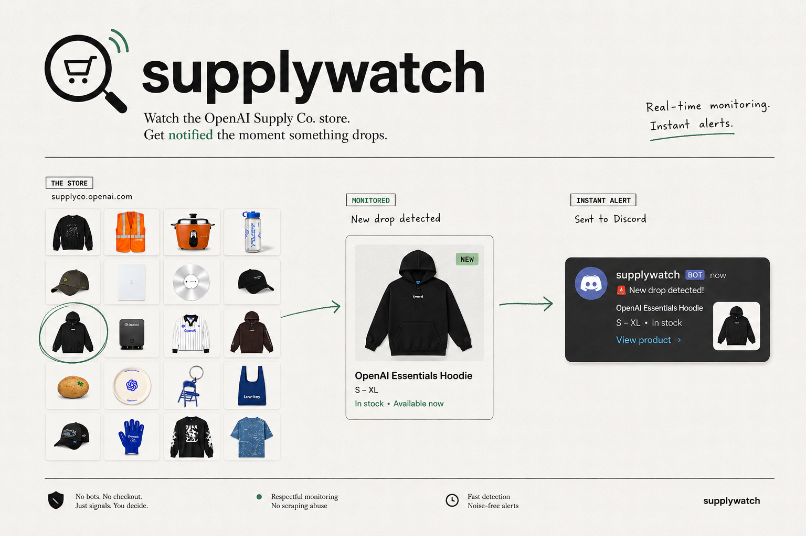

# supplywatch



supplywatch is a headless watcher for public OpenAI merch availability on `https://supplyco.openai.com`.

supplywatch renders the public Supply site with Playwright, watches product cards for candidate signals, opens product detail states, stores results in SQLite, and sends Discord webhook alerts only when public purchase availability is confirmed.

## Stack

- Node.js 22+
- TypeScript
- Playwright for rendered-page inspection
- Cheerio as an HTML parsing fallback
- SQLite via `better-sqlite3` with Drizzle state migrations
- Discord webhooks
- Docker for deployment

## Local Setup

```bash
pnpm install
cp .env.example .env
pnpm playwright:install
pnpm dev poll-once
```

`DRY_RUN=true` is the default. A dry run prints would-send Discord payloads but leaves pending alert state intact, so confirmed alerts can still send later when Discord is enabled.

## Discord Webhook

1. In Discord, open the target server and channel.
2. Open channel settings, then **Integrations** -> **Webhooks**.
3. Create a webhook, name it `supplywatch`, and copy its webhook URL.
4. Set it in `.env`:

```bash
DISCORD_WEBHOOK_URL=https://discord.com/api/webhooks/...
DRY_RUN=false
```

Test the webhook before starting the worker:

```bash
curl -H "Content-Type: application/json" -d '{"content":"supplywatch webhook test"}' "$DISCORD_WEBHOOK_URL"
```

Anyone with the webhook URL can post to that channel. Keep it out of git and rotate/delete it in Discord if it leaks.

## Scripts

```bash
pnpm dev                  # run the scheduled worker loop
pnpm dev poll-once        # run one poll cycle
pnpm capture:fixture -- --url https://supplyco.openai.com --state out-of-stock --name example
pnpm build
pnpm start
pnpm typecheck
pnpm test
pnpm db:generate          # generate Drizzle migrations from src/state/tables.ts
pnpm db:migrate           # apply migrations to DATABASE_PATH
pnpm db:studio            # inspect DATABASE_PATH with Drizzle Studio
```

Fixture capture renders the supplied product/detail URL with Playwright and saves
`detail.html` plus `metadata.json` under `fixtures/product-states/<state>/<name>/`.
Use states such as `out-of-stock`, `purchase-button`, `employee-gated-login`,
`sized`, `sizeless`, `disabled-size`, `enabled-size`, or
`animate-wiggle-candidate`.

`DATABASE_PATH` remains the source of truth for the watcher state database. The
Drizzle config defaults to `./data/supplywatch.sqlite`, matching the app's
runtime default when the environment variable is not set.

## Docker

```bash
docker build -t supplywatch .
docker run -d --name supplywatch --env-file .env -v "$PWD/data:/app/data" supplywatch
```

To verify the container without starting the loop:

```bash
docker run --rm --env-file .env -v "$PWD/data:/app/data" supplywatch node dist/worker.js poll-once
```

## Deployment

1. Install Docker on a VPS, Raspberry Pi, or other always-on host.
2. Copy `.env.example` to `.env`.
3. Keep `DRY_RUN=true` and run one poll cycle.
4. Review the dry-run summary and SQLite state under `data/`.
5. Set `DISCORD_WEBHOOK_URL`.
6. Set `DRY_RUN=false`.
7. Start the Docker container with `data/` mounted to `/app/data`.

The default cadence is a 60-second poll, 15-second observation window, hourly full sweep, three out-of-stock confirmations before detail-check retirement, and 10 Discord retry attempts over roughly 24 hours.

Full sweeps inspect product details sequentially. The first run can take longer than the polling interval when many products are visible.

## Current MVP Boundaries

- This app watches public availability only.
- It must not automate purchasing, bypass login, or complete checkout.
- Discord alerts are sent only for confirmed availability or operational health events.
- `animate-wiggle` is a candidate signal, not the source of truth.
- Products confirmed out of stock three times may be retired from detail checks.
- Debug artifacts are saved under `data/debug-artifacts/` for confirmed availability and inspection failures.
